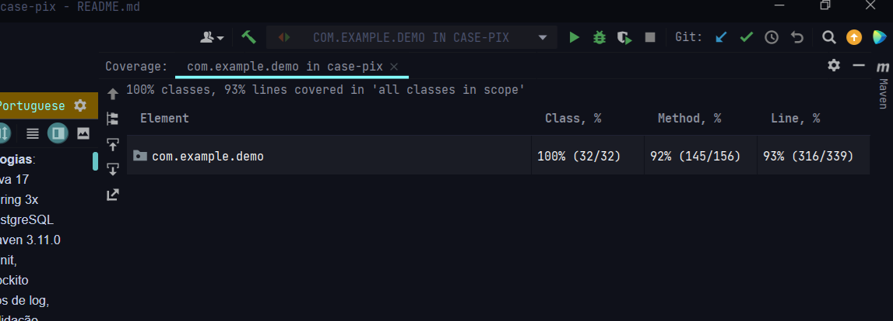

# Pix Case

## Decisões gerais
1. **Tecnologias**:
    - Java 17
    - Spring 3x
    - PostgreSQL
    - Maven 3.11.0
    - JUnit, Mockito
    - Libs de log (Sl4fj, LogstashEncoder p/ structured logs), validação (Jakarta), DB
    - Hibernate, JPA
4. **Banco**:
    - Duas tabelas, TB_CORRENTISTA e TB_CHAVE_PIX, numa relação de 1:N

5. **Deploy**:
    - Azure App Services - pela simplicidade de deploy focado em 1 container já com URL e geração de pipeline rápida.
    - Postgresql na Azure
    - Github como versionador e CI/CD do Github.
    - Docker e compose pra rodagem local
   
6. **Arquitetura**:
    - MVC por ser mais simples pro case
7. **Cobertura de testes**:
    - Print Intellij

3. **Consultas implementadas**:
   - Inclusão de chave
      - POST /v1/key/add
   - "Deleção"/inativação de chave
      - PATCH /v1/key/deactivate
   - Alteração de chave (considerando a inativação)
      - PUT /v1/key
   - Buscas combinadas de a) à e): GET /v1/key (considerando a inativação)
      - Busca por ID
      - Busca por tipo de chave
      - Busca por agência e conta
      - Busca por nome do correntista
   - Extra POST /holder apenas pra comportar a ideia de TipoPessoa (PF/PJ) e ter uma conta antes de adicionar uma chave
2. **Chaves pix aceitas**:
   - CPF, CNPJ, Email, Aleatorio (4)
## Decisões de implementação
1. **Camada comum de validação inicial**:
    - Usei a biblioteca Jakarta Validation, @Size, @NotEmpty, @Pattern (para tipo-conta e tipo-chave por exemplo. Não adicionei enum pois eu quis habilitar case insensitive para esses campos) pois não gostaria de bloquear o usuário caso ele escrevesse "Celular" ao invés de "celular"
2. **Validação de máximo de chaves para correntista PF ou PJ**:
    - O enunciado não menciona um identificador de PF ou PJ para os inputs. Então se eu quisesse incluir como PF 5 chaves de email, e fosse adicionar a 6a, não teria como validar se sou PF. Por isso, no banco eu adicionei a coluna "TIPO_PESSOA" (PF ou PJ) para a tabela TB_CORRENTISTA.
        - E para comportar a inclusão de chave para uma conta que existe, bem como essa validação de máximo de chaves:
            - Criei um endpoint POST /holder para simular a criação do correntista, que possui um tipo-pessoa.
            - Poderia adicionar o parâmetro tipo-pessoa nos inputs, não fiz isso pois não acho que faria sentido criar uma conta logo ao incluir uma chave. Embora provavelmente o endpoint POST /holder não ficaria no mesmo serviço de criação de chave na vida real
3. **Validações de chaves**:
    - A validação completa é feita com um Facade (ValidationFacadeService), que valida a regra de duplicidade e regra de máximo de chaves (classe KeyValidationService), bem como valida cada tipo de chave, num switch (não quis usar Strategy, pois o escopo da validação está bem definido e teríamos muitas classes). Certamente Strategy faria sentido num projeto real, já que poderiamos fazer reuso de validações de CPF e CNPJ por exemplo
4. **Consultas de banco**:
    - Algumas delas retornam View/DTO ao invés da entidade, pra não retornar tantos dados em algumas consultas
5. **Logs**:
    - Criei business rules no Enum ErrorMessage
    - Usei Logback pra formatar os logs como chave (LogstashEncoder, usado como layout no logback), mas isso foi sóo preferência pessoal pra leitura de logs
    - Tenho um Exception Handler Global para BusinessException e Exceptions de validação de campo, bem como um geral pra exceptions nao tratadas (padrão que costumo usar no trabalho)
    - Uso MDC pra criar logs estruturados com requestId
    - Uso Lombok para alguns boilerplates
